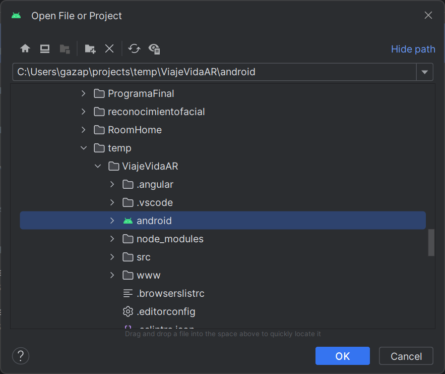

# Viaje de la Vida AR

Aplicacion android complemento de ["Viaje de la Vida"](https://github.com/EGAMAGZ/ViajeDeLaVida).

## Requerimientos

| Tecnologia | Version | Link |
|------------|---------|------|
| Node | 20.1.0 o mayor | [Pagina](https://nodejs.org/en)|
| Git | Cualquier | [Pagina](https://git-scm.com/)|
| Android Studio (En caso de ejecutar en android) | Giraffe 2022.3.1 o menor | [Pagina](https://developer.android.com/studio)|

## Descarga de proyecto

Para descargar el proyecto se puede realizar de dos maneras:

* Clonar el repositorio desde GitHub

Es necesario tener instalado git, para corroborar si se tiene instalado git, se puede ejecutar el siguiente comando en la terminal:

```bash
git --version
```

El cual devolvera la version de git instalada, por ejemplo:


Para descargar el proyecto con Git, se realiza clonando el repositorio desde GitHub ejecutando el siguiente comando en la terminal:

```bash
git clone https://github.com/EGAMAGZ/ViajeVidaAR.git
```

Dicho comando, creara un nuevo directorio en la ruta del proyecto, el cual se llamara `ViajeVidaAR` en la ruta actual en la terminal. Ejemplo:


* Descargar el zip del proyecto

Para descargar el zip del proyecto se es necesario ir al [repositorio](https://github.com/EGAMAGZ/ViajeVidaAR) y dar click en `Code > Download ZIP`:


## Instalación de dependencias

Una vez que se tiene clonado el repositorio o descargado el zip, nos redirecionaremos a la carpeta `ViajeVidaAR` en la terminal:

```bash
cd ViajeVidaAR
```

Y para las dependencias del projecto se debe realizar el siguiente comando en la terminal:

```bash
npm install
```

Ejemplo:


## Ejecución

### Escritorio

Para ejecutar el proyecto se debe realizar el siguiente comando en la terminal:

```bash
npm start
```

Una vez que se ejecute el proyecto, se genera el proyecto y abira el navegador una vez terminado.

### Android

Para ejecutar el proyecto en Android, se debe compilar el proyecto (web) con el siguiente comando:

```bash
npx ionic build  --configuration=production && npx cap copy
```

Una vez terminada la compilación, se necesita sincronizar el proyecto con el dispositivo. Para hacerlo, se debe realizar el siguiente comando en la terminal:

```bash
npx cap sync --inline
```

Una vez terminada la sincronización, se debe de abrir el proyecto, la carpeta `android` que encontramos en el proyecto, en Android Studio.





Al abrir el proyecto, este empezara a instalar las librerias e indexar el proyecto. Una vez que termine el proceso, se nos habilitara el panel superior para la ejecución y debug de la aplicación.


Una vez todo esto, conectamos nuestro dispositivo a la computadora (y aceptamos el permiso de USB Debugging que nos mostrará en el dispositivo Android). Cuando el nombre de nuestro dispositivo en el superior, ejecutamos el proyecto, el cual instalará y abrira la aplicación en el dispositivo.


*NOTA:* Es necesario que nuestro telefono tenga activada la funcionalidad de USB Debugging. [Tutorial para activar USB Debugging](https://youtube.com/shorts/p7DDuq56suU?si=2yxmXH1cOhAu1tap)

*NOTA:* Es necesario que nuestro telefono tenga conexión a internet al ejecutar el proyecto.

## Recursos (extras)

[Marcador por defecto (para pruebas)](https://jeromeetienne.github.io/AR.js/data/images/HIRO.jpg)
